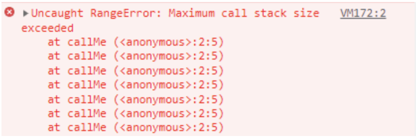

# 스택 (Stack)

함수 호출은 스택처럼 쌓이는데, 맨 위 함수가 종료되면 그 다음 함수, 또 그 다음 함수가 불려지는 형태로 동작함
스택이라는 자료구조를 프로세스 동작방식으로 쓰인다.

- 데이터를 제한적으로 접근할 수 있는 구조
    - 한쪽 끝에서만 자료를 넣거나 뺄 수 있는 구조
- 가장 나중에 쌓은 데이터를 가장 먼저 빼낼 수 있는 데이터 구조
    - 큐 : FIFO 정책
    - 스택: LIFO 정책

## 1. 스택 구조

- 스택은 LIFO(Last In, First Out) 또는 FILO(First In, Last Out) 데이터 관리 방식을 따름
    - LIFO : 마지막에 넣은 데이터를 가장 먼저 추출하는 데이터 관리 정책
    - FILO : 처음에 넣은 데이터를 가장 마지막에 추출하는 데이터 관리 정책
- 대표적인 스택의 활용
    - 컴퓨터 내부의 프로세스 구조의 함수 동작방식
- 용어
    - push : 데이터를 스택에 넣기
    - pop : 데이터를 스택에서 꺼내기

## 2. 스택의 장단점

- 장점
    - 구조가 단순해서 구현이 쉽다
    - 데이터 저장/읽기 속도가 빠르다
- 단점
    - 데이터 최대 갯수를 미리 정해야한다.
    - 저장 공간의 낭비가 발생할 수 있음
        - 미리 최대 갯수만큼 저장 공간을 확보해야함
        - 스택이 할당된 공간보다 많은 공간을 차지하면 "stack overflow" 에러가 발생한다.
            - 자바스크립트에서는 Maxmimum call stack 이라고 에러가 뜨고 콜스택에 쌓인 함수들이 보임

> 스택은 단순하고 빠른 성능을 위해 사용되므로, 보통 배열 구조를 활용해서 구현하는 것이 일반적임.
이 경우, 위에서 열거한 단점이 있을 수 있음
