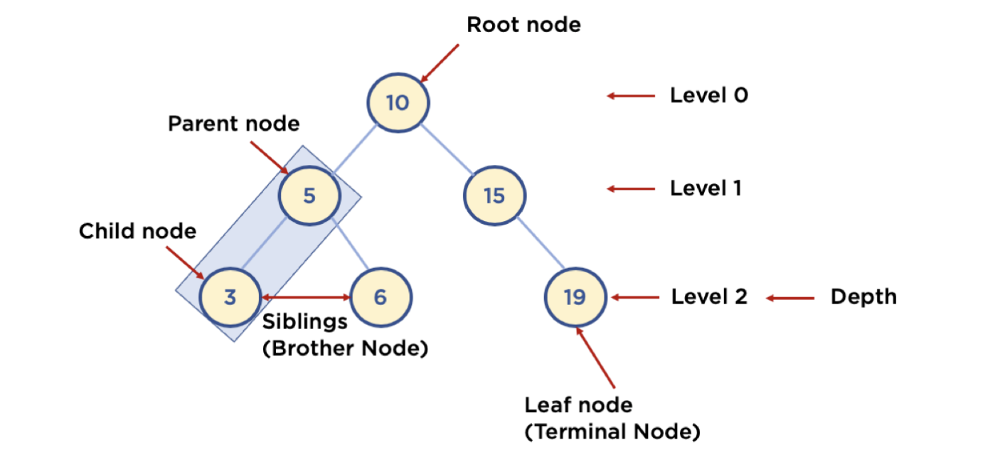

# 트리(Tree)

## 1. 트리 (Tree) 구조

- 트리: Node와 Branch를 이용해서, 사이클을 이루지 않도록 구성한 데이터 구조
    - 트리는 branch(나뭇가지)로 이루어진 데이터 구조여서, 사이클이 되지않고 항상 위에서 아래로 연결이 됩니다.
- 실제로 어디에 많이 사용되나?
    - 트리 중 이진 트리 (Binary Tree) 형태의 구조로, 탐색(검색) 알고리즘 구현을 위해 많이 사용됨
        - 트리 중에서도 브랜치가 최대 2개인 이진트리 구조가 가장 많이 쓰이며, 탐색에서 쓰인다.

## 2. 알아둘 용어

- Node: 트리에서 데이터를 저장하는 기본 요소 (데이터와 다른 연결된 노드에 대한 Branch 정보 포함)
- Root Node: 트리 맨 위에 있는 노드
- Level: 최상위 노드를 Level 0으로 하였을 때, 하위 Branch로 연결된 노드의 깊이를 나타냄
- Parent Node: 어떤 노드의 다음 레벨에 연결된 노드
- Child Node: 어떤 노드의 상위 레벨에 연결된 노드
- Leaf Node (Terminal Node): Child Node가 하나도 없는 노드
- Sibling (Brother Node): 동일한 Parent Node를 가진 노드
- Depth: 트리에서 Node가 가질 수 있는 최대 Level

## 3. 이진 트리와 이진 탐색 트리 (Binary Search Tree)

### 이진트리와 이진 탐색 트리는 다르다.

- 이진 트리: 노드의 최대 Branch가 2인 트리
- 이진 탐색 트리 (Binary Search Tree, BST): 이진 트리에 다음과 같은 추가적인 조건이 있는 트리
    - 왼쪽 노드는 해당 노드보다 작은 값, 오른쪽 노드는 해당 노드보다 큰 값을 가지고 있음!

### 27 값을 찾는다고 생각해보자

- 이진탐색트리로 찾으면 3 step으로 찾음
- 정렬이된 배열 구조에서 탐색하려면 처음부터 27이 나올때까지 검색해야함. 최악의경우는 배열끝까지 가야할수도있음

### 4. 자료 구조 이진 탐색 트리의 장점과 주요 용도

- 주요 용도: 데이터 검색(탐색)
- 장점: 탐색 속도를 개선할 수 있음

> 데이터를 저장해놓을때 이진 탐색 트리 구조로 저장해놓고, 그 안에서 데이터를 빠르게 검색한다.
