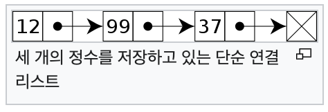

# 링크드 리스트 (Linked List)

## 1. 링크드 리스트 (Linked List) 구조

- 연결 리스트라고도 함
- 배열은 순차적으로 연결된 공간에 데이터를 나열하는 데이터 구조
- 링크드 리스트는 떨어진 곳에 존재하는 데이터를 화살표로 연결해서 관리하는 데이터 구조

- 링크드 리스트 기본 구조와 용어
    - 노드(Node): 데이터 저장 단위 (데이터값, 포인터) 로 구성
    - 포인터(pointer): 각 노드 안에서, 다음이나 이전의 노드와의 연결 정보를 가지고 있는 공간

- 일반적인 링크드 리스트 형태

## 2. 링크드 리스트의 장단점 
(전통적인 C언어에서의 배열과 링크드 리스트)

- 장점
    - 미리 데이터 공간을 미리 할당하지 않아도 됨
        - 배열은 **미리 데이터 공간을 할당** 해야 함
- 단점
    - 연결을 위한 별도 데이터 공간이 필요하므로, 저장공간 효율이 높지 않음
    - 연결 정보를 찾는 시간이 필요하므로 접근 속도가 느림
    - 중간 데이터 삭제시, 앞뒤 데이터의 연결을 재구성해야 하는 부가적인 작업 필요

배열은 미리 특정한 연결된 공간을 예약해두고 거기에서 데이터를 쓰고 읽는 구조이다. 
이에 반해서 링크드리스트는 미리 예약을 해놓지않고 필요할때마다 데이터를 더 추가추가할 수 있는 구조이다. 
일종의 배열의단점을 극복한 자료구조가 링크드리스트이다.

## 3. 시간복잡도

- 검색 O(n)
- 삽입 O(1)
