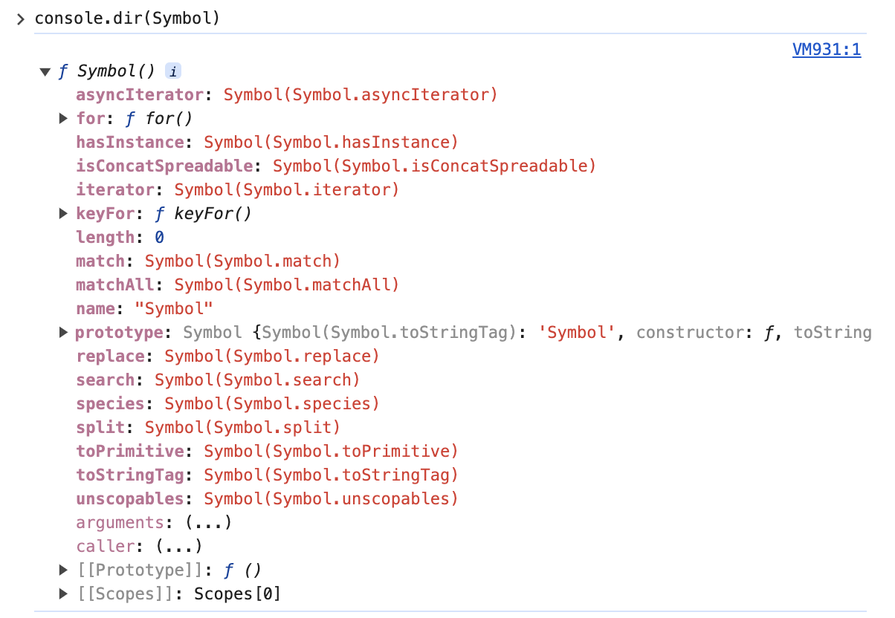

# Well-known Symbol 빌트인 심벌 값
Well-know Symbol은 자바스크립트가 기본 제공하는 빌트인 심벌 값이다.
빌트인 심벌값(Built-in Symbol values)은 객체의 특정 내장 동작을 사용자 정의하기 위한 고유 심볼들이다.

## 빌트인 심벌 값은 Symbol 함수의 프로퍼티에 할당되어 있다.
Symbol 함수의 프로퍼티

## Symbol.iterator
Symbol.iterator는 이터레이터 프로토콜을 준수하는 이터레이터를 반환하는 메서드를 정의한다.
