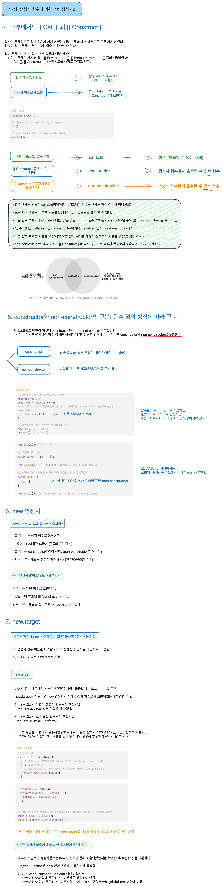

# 생성자 함수(constructor)

### 1. Object 생성자 함수
### 2. 생성자 함수
### 3. 생성자 함수의 인스턴스 생성 과정

### 4. 내부 메서드 [[Call]]과 [[Construct]]
### 5. constructor와 non-constructor의 구분
### 6. new 연산자
### 7. new.target

---
### Refer
모던자바스크립트 Deep dive
