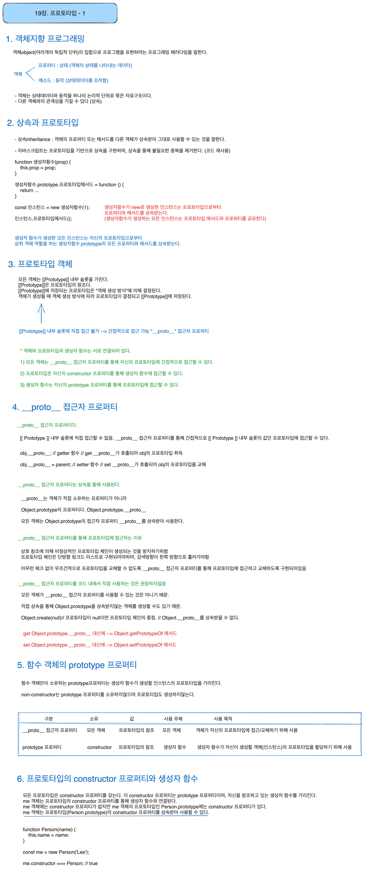

# 프로토타입 정리



## 프로토타입 존재 확인
`in` 연산자와 `Reflect.has` 메서드

## 프로토타입 열거

### 1. `for ... in` 문

객체의 모든 프로퍼티를 순회하며 열거한다.

for … in문은 객체의 프로토타입 체인 상에 존재하는 모든 프로토타입의 프로퍼티 중에서 프로퍼티 어트리뷰트 [[Enumerable]]의 값이 true인 프로퍼티를 순회하며 열거한다.

```javascript
for (변수선언문 in 객체) { ... }
```

- 순서를 보장하지 않음 (프로퍼티 키 숫자는 정렬됨)
- 심벌인 프로퍼티는 열거하지 않음
- 객체의 프로퍼티 개수만큼 순회, for … in문의 변수 선언문에서 선언한 변수에 프로퍼티 키를 할당한다.
- **순회 대상 객체의 프로퍼티 뿐만 아니라 상속받은 프로토타입의 프로퍼티까지 열거한다.**
    - 안나온다면 **프로퍼티 어트리뷰트 [[Enumerable]]의 값이 false이기 때문**

### 2. Object.keys/values/entries 메서드

객체 자신의 고유 프로퍼티만 열거한다.

- Object.keys 메서드 : 열거 가능한 프로퍼티 키를 배열로 반환
- Object.values 메서드 : 열거 가능한 프로퍼티 값을 배열로 반환
- Object.entries 메서드 : 열거 가능한 프로퍼티 키 + 값의 쌍의 배열을 배열에 담아 반환

### Refer
모던자바스크립트 Deep dive
