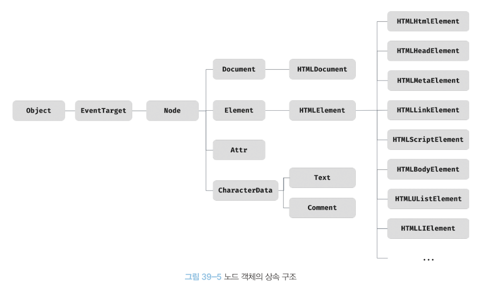

# 노드 객체의 상속구조

노드 객체는 프로토타입에 의한 상속 구조를 갖는다.

### 프로토타입 체인의 상위
- 모든 노드 객체는 Object, EventTarget, Node 인터페이스를 상속받는다
- EventTarget 인터페이스는 이벤트에 관련된 기능을 제공한다
- Node 인터페이스는 노드 관련 기능(트리 탐색 기능, 노드 정보 제공 기능 등)을 제공한다
- HTMLElement 인터페이스는 HTML 요소가 갖는 공통적인 기능을 제공한다

### 프로토타입 체인의 하위
- 요소의 종류에 따라 고유한 기능이 있다
- 요소 노드별로 HTMLInputElement, HTMLDivElement 등 요소의 종류에 따라 각각 다르다.